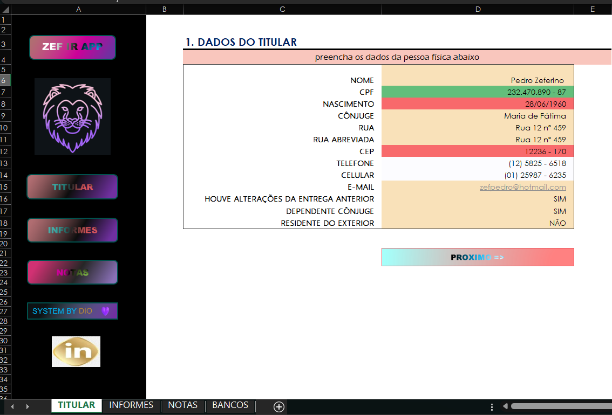
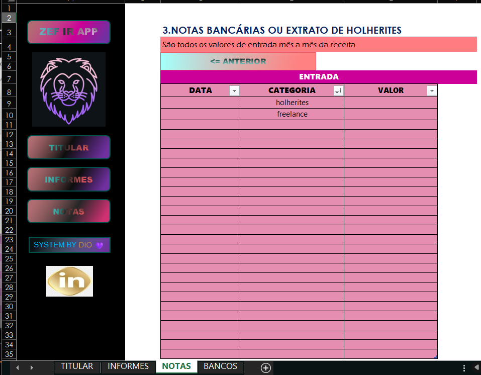

# ZEF IR APP - Organizador para Declaração de Imposto de Renda

Esta planilha foi desenvolvida no Excel para simplificar e organizar a coleta de dados necessários para a Declaração Anual de Imposto de Renda de Pessoa Física (IRPF).

Com uma interface intuitiva e funcionalidades interativas, a ferramenta visa facilitar o dia a dia do contribuinte, centralizando todas as informações em um único lugar.

## Funcionalidades

* **Navegação Intuitiva:** Menus e botões que facilitam o acesso rápido às diferentes seções da planilha.
* **Cadastro de Dados Pessoais:** Uma área dedicada para inserir e manter atualizados os dados do titular da declaração.
* **Controle de Informes de Rendimentos:** Permite registrar os valores de rendimentos bancários e associá-los aos respectivos informes digitalizados.
* **Registro de Notas e Holerites:** Facilita o lançamento de receitas mensais, como salários e trabalhos freelance, com categorias pré-definidas.
* **Gerenciamento de Bancos:** Cadastro centralizado dos bancos para facilitar o preenchimento dos informes.

## Como Usar

Siga os passos abaixo para utilizar a planilha de forma eficiente no seu dia a dia.

### Passo 1: Preencha os Dados do Titular

1. Acesse a aba **TITULAR**.
2. Preencha todos os campos com seus dados pessoais, como Nome Completo, CPF, Data de Nascimento e Endereço.
3. Responda às perguntas de confirmação no final do formulário, como "Houve alterações da entrega anterior?".

### Passo 2: Cadastre seus Bancos

1. Vá para a aba **BANCOS**.
2. Cadastre nesta seção todos os bancos onde você possui conta.
3. Esta lista será usada para agilizar o preenchimento na aba de Informes.

### Passo 3: Registre os Informes de Rendimentos

1. Acesse a aba **INFORMES**.
2. Para cada conta bancária, selecione o banco (previamente cadastrado), insira o valor total do rendimento anual conforme o informe fornecido pelo banco.
3. No campo "NOME", você pode colocar o nome do arquivo do informe digital (ex: `informe_banco_xyz.pdf`) para referência futura. O valor total de todos os informes será somado automaticamente.

### Passo 4: Lance as Notas e Holerites

1. Acesse a aba **NOTAS**.
2. Utilize esta seção para registrar todas as suas fontes de renda mensais.
3. Preencha a **Data**, selecione a **Categoria** (ex: "holerites" ou "freelance") e insira o **Valor** recebido.

Com esses passos, você manterá seus dados fiscais organizados e prontos para a declaração.

## Telas da Aplicação

### Tela do Titular

### Tela de Informes de Rendimentos

### Tela de Notas e Holerites

---

* Desenvolvido por Pedro Zeferino da Silva.
